# Игра "Raft"

## Анализируемый кадр
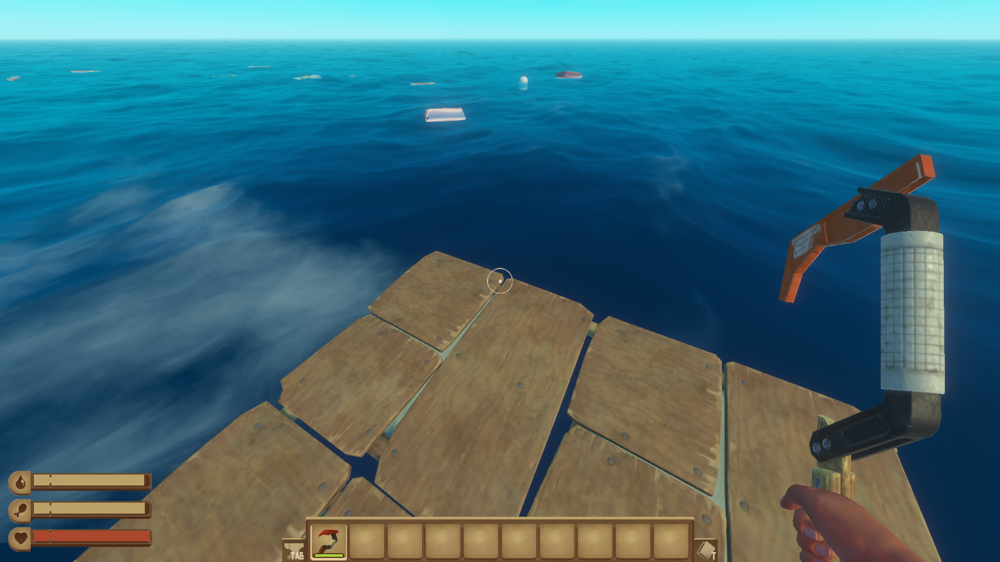

## Вид в renderdoc
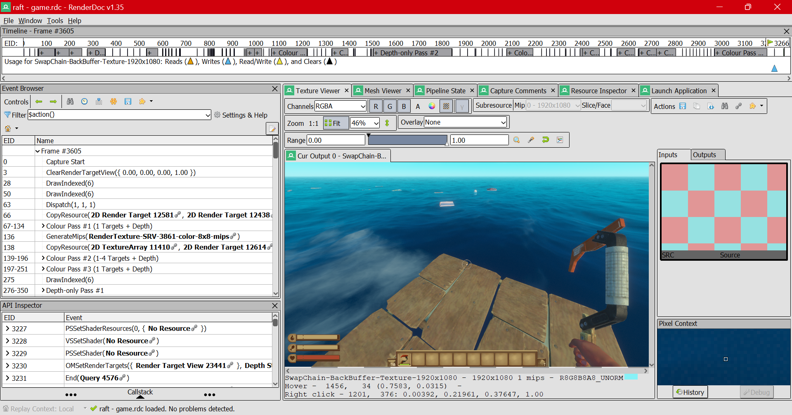

## Процесс построения кадра

Не все именно в таком порядке, некоторые этапы вычисления вида объектов перемешаны.

### 1. Создание вида моря
Создается море, с волнами. Волны просчитываются с помощью FFT по всей видимости: в пояснении к кадру есть WavesRendererFFT (видимо, какой-то встроенный механизм directx11...) и WavesDisplacementMap -- карта расположения волн в переводе на русский. 

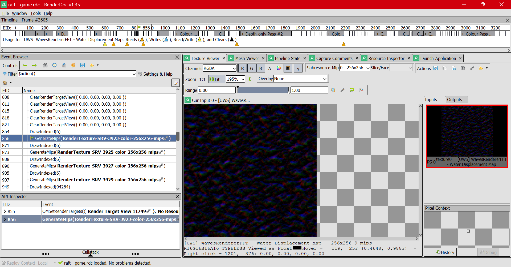

След на воде от движения плота.

Промужеточный этап выглядит так.

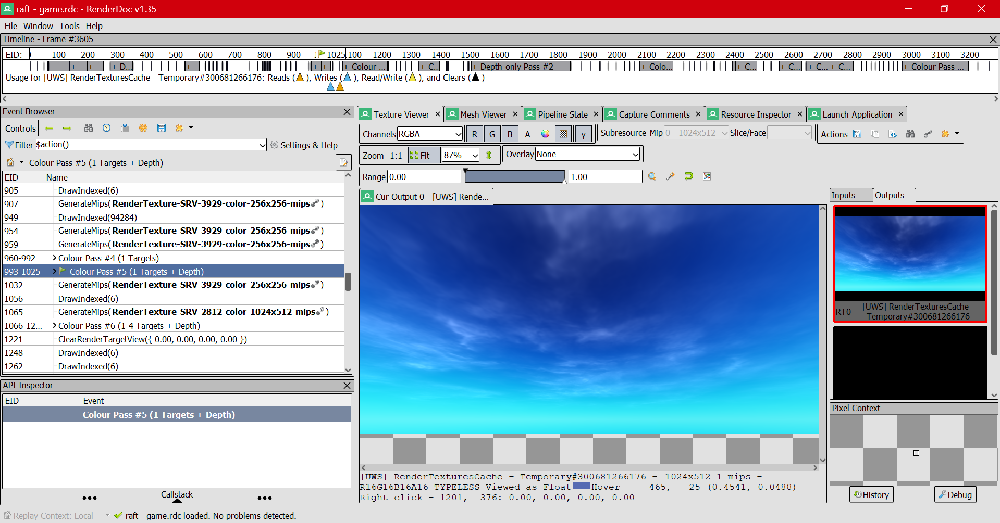

Через несколько шагов, когда будет инструмент и плот, все будет выглядеть так. Странно, почему этот вид (сцена) стоит сразу после следа плота в списке событий.. 

Видимо, мы в renderdoc самое последнее состояние этой картинки. Т.к. не создавалась промежуточная, а перезаписывалась уже существующая.

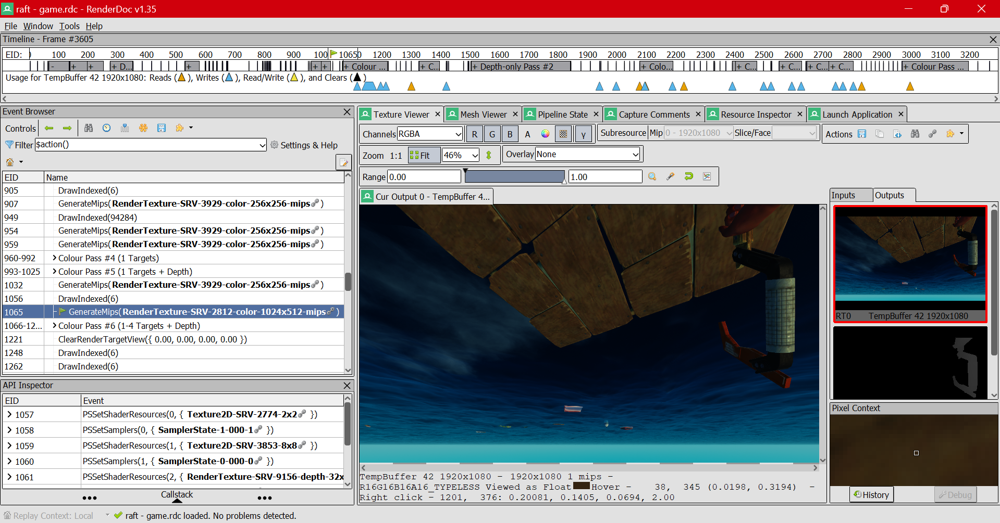

### 2. Плот и мусор

Текстура плавающих объектов. Они считаются внутри прохода обработки colour pass #6 (pass). Можно пройтись по командам внутри пасса и увидеть, как объекты появляются один за одним!  
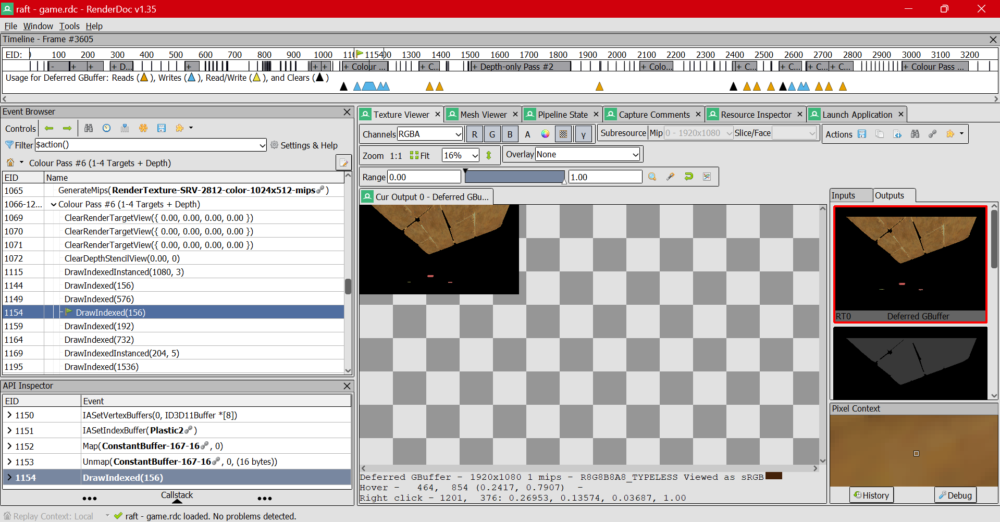

### 3. Создание вида неба и облаков

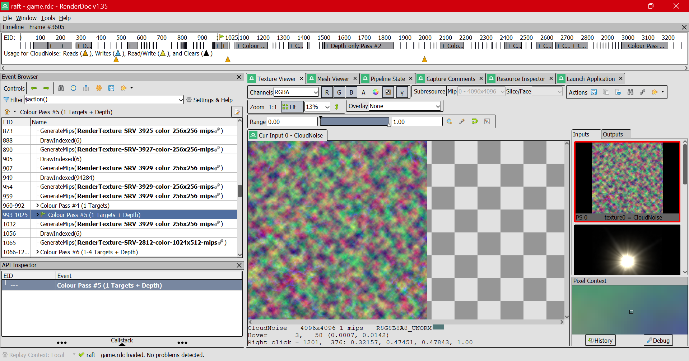

`CloudNoise` -- все понятно: шум, из которого будут созданы облака. :)

Хотел собрать еще скриншотов, но второй раз не смог найти в event browser.. Хотя такой этап, по всей видимости, есть.

### 4. Карта нормалей

Видел в dota 2 такой эффект, как карта нормалей. Его можно включить и выключить. Но теперь мы это видим и в renderdoc. Пока не знаю, что это такое.  
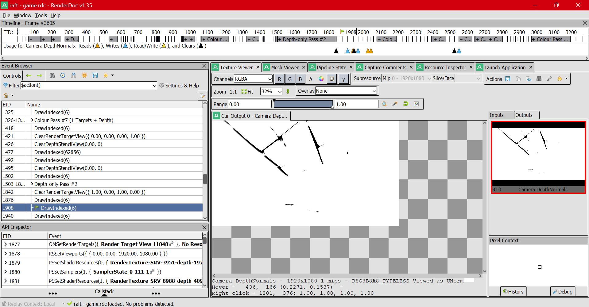

### 5. Наложение текстуры на инструмент (крюк в нашем случае)

Где-то до этого считалось его положение. Выглядело это как черное на черном, вычислялся именно сам объект. А теперь происходит "разукрашивание" в виде наложения такой текстуры. На втором вводе видна карта, какие участки текстуры будут выбраны.

Текстура крюка.  
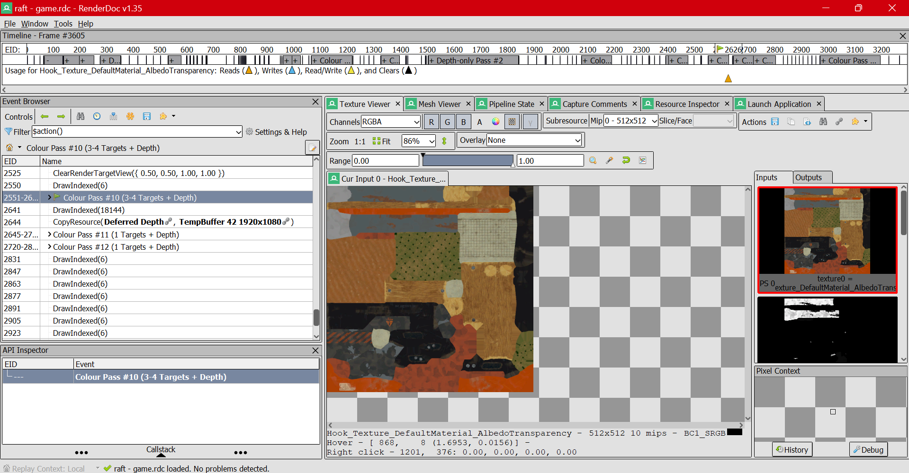

Готовый крюк.  
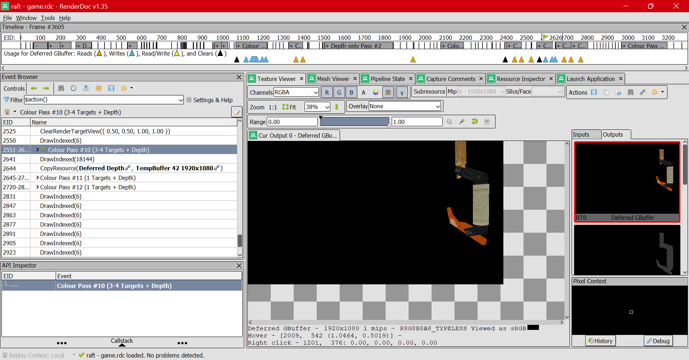

### 6. Сведение в один кадр

Весь кадр.  
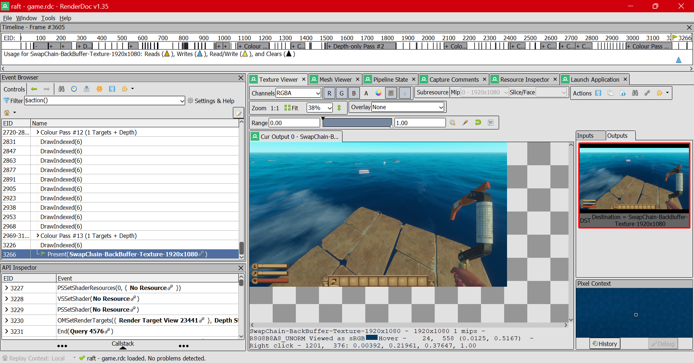

## Другая информация
Шейдеры не удалось найти в захвате. Возможно, дело в том, что игра использовала directx11, а не vulkan..

Не особо понятно, в каком порядке идут события. Возможно, дело в том, что они происходят параллельно. А мы их пытаемся записать в одну последовательность. Так мы можем увидеть лишь отношения зависимостей: то, что требуется для операции, должно быть получено ранее.

Если вдруг недостаточно глубокий анализ, скажите мне, постараюсь обратить внимание на то, что вам интересно.

TG: https://t.me/valeriy_zainullin
